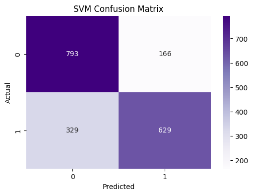
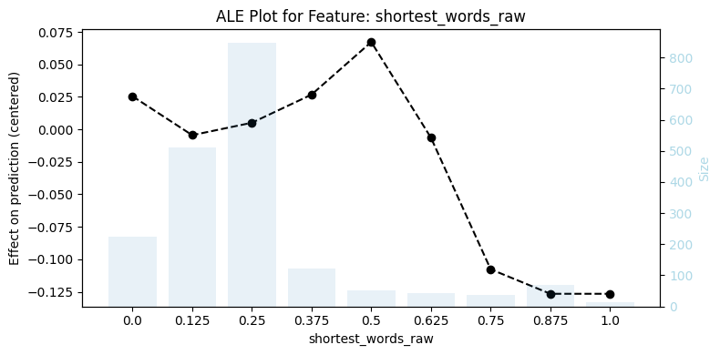
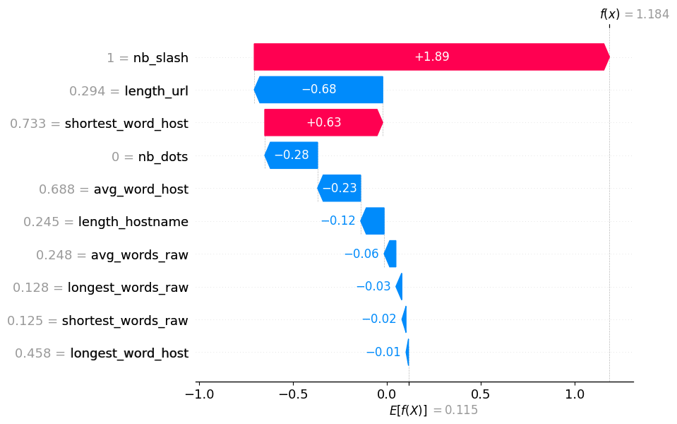
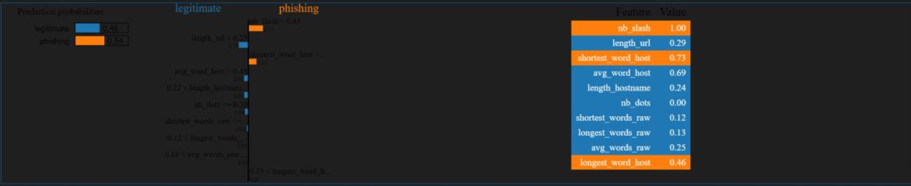
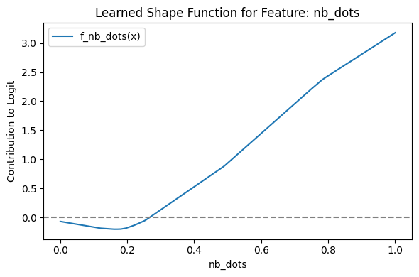

# Tabular Data Interpretability: Phishing Detection

This repository focuses on applying various explainable AI (XAI) algorithms to interpret machine learning models trained on tabular data. The goal is to make black-box models transparent and understandable.

## Overview
We trained Logistic Regression and Support Vector Machine (SVM with RBF kernel) models on a Phishing Web Page dataset to classify URLs as legitimate or phishing. To explain the model's decision-making process, we implemented the following interpretability techniques:

*   **Global Interpretability:**
    *   Partial Dependence Plots (PDP)
    *   Accumulated Local Effects (ALE)
*   **Local Interpretability:**
    *   Individual Conditional Expectation (ICE)
    *   Local Interpretable Model-agnostic Explanations (LIME)
    *   SHapley Additive exPlanations (SHAP)
*   **Rule-Based Explanations:**
    *   Anchor explanations
*   **Inherently Interpretable Models:**
    *   Neural Additive Models (NAM)

---

## Sample Outputs

### Model Performance
Confusion Matrix for the SVM (RBF Kernel) model:
<br>


### Global Explanations (ALE)
Accumulated Local Effects plot showing the impact of the `nb_dots` feature on the model's prediction:
<br>


### Local Explanations (SHAP & LIME)
SHAP Waterfall plot detailing the exact contribution of each feature for a specific URL classification:
<br>


Local explanation using LIME for a sample prediction:
<br>


### Neural Additive Models (NAM)
Learned shape functions from the NAM model for specific features:
<br>


---

## Installation & Usage

1. Clone the repository:
```bash
git clone [https://github.com/yourusername/tabular-data-interpretability.git](https://github.com/yourusername/tabular-data-interpretability.git)
cd tabular-data-interpretability
